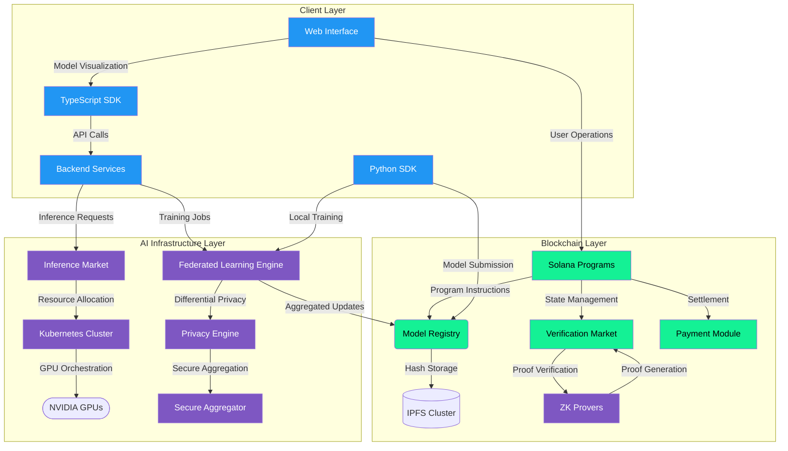

# Umazen: Decentralized AI Infrastructure on Solana


[](https://opensource.org/licenses/Apache-2.0)
[](https://solana.com/)
[](https://discord.gg/umazen)

**Production-Grade Framework for On-Chain AI Model Training & Inference Markets**

**Build a decentralized AI infrastructure on Solana, enabling secure on-chain model training and creating a global marketplace for AI inference services**

🐦 Follow us on [Twitter](https://x.com/Umazenworld)


## Table of Contents
- [Architecture Overview](#architecture-overview)
- [Key Features](#key-features)
- [Getting Started](#getting-started)
  - [Prerequisites](#prerequisites)
  - [Installation](#installation)
  - [Configuration](#configuration)
- [Development Workflow](#development-workflow)
  - [Local Development](#local-development)
  - [Testing](#testing)
  - [Production Deployment](#production-deployment)
- [Security](#security)
- [Performance Optimization](#performance-optimization)
- [Contributing](#contributing)
- [License](#license)

## Architecture Overview


The system comprises three core layers:

1. **Blockchain Layer**
   - Solana Program Modules
   - On-Chain Model Registry
   - Proof Verification System

2. **AI Infrastructure Layer**
   - Federated Learning Engine
   - ZKML Proof Generation
   - Distributed Inference Nodes

3. **Client Layer**
   - TypeScript SDK
   - Python Training Toolkit
   - React Web Interface

## Key Features

### Core Capabilities
- 🧠 **On-Chain Model Training**
  - Federated Learning with Cryptographically Verified Updates
  - Privacy-Preserving Training via Secure Aggregation
  - Model Version Control with Merkleized Snapshots

- ⚡ **Inference Marketplace**
  - Real-Time Bidding System for Compute Resources
  - ZK-Proof Verified Inference Results
  - Multi-Currency Payment Support

- 🔒 **Security Framework**
  - Role-Based Access Control (RBAC)
  - Model Integrity Proofs using Poseidon Hashes
  - Encrypted Model Weights Storage

### Advanced Functionality
- Parallelized Proof Generation using CUDA
- Automated Model Quantization (FP32 → INT8)
- Cross-Chain Verification Bridges
- Dynamic Pricing Oracle for Compute Resources
- GPU-Optimized Training Pipelines

## Getting Started

### Prerequisites

**System Requirements**
- x86_64 Architecture (AVX2 Support Required)
- NVIDIA GPU (Compute Capability ≥ 7.0)
- 64GB RAM (Minimum)
- 1TB NVMe SSD

**Software Dependencies**
- Rust 1.71+ (with Solana Tool Suite)
- Python 3.10+ (CUDA 12.1 Toolkit)
- Node.js 20.0+ (PNPM 8.15+)
- PostgreSQL 15+ with TimescaleDB
- IPFS Kubo 0.22.0+

### Installation

**1. Clone Repository**
```bash
git clone --recurse-submodules https://github.com/umazen/umazen.git
cd umazen
```

**2. Install Core Dependencies**
```
# Install Solana Toolchain
./scripts/install_solana.sh

# Setup Python Environment
make venv && source .venv/bin/activate
pip install -r requirements.txt

# Install Node Modules
pnpm install
```

**3. Initialize Infrastructure**
```
# Start Local Validator
solana-test-validator --reset --quiet &

# Deploy Programs
anchor build && anchor deploy

# Start IPFS Cluster
ipfs init --profile=test
ipfs daemon --enable-gc --routing=dhtclient &
```

## Configuration
### Environment Variables
```
# .env.example
SOLANA_RPC_URL="https://api.mainnet-beta.solana.com"
MODEL_REGISTRY_PROGRAM_ID="Umaz...1111"
ZK_PROVER_KEY_PATH="./keys/prover.key"
INFERENCE_NODE_GPU=0,1  # Comma-separated GPU indices
```

## Development Workflow
### Local Development
```
# Start Development Servers
make dev

# Program Hot-Reloading
anchor watch
```

### Testing
```
# Run All Test Suites
make test

# Specific Test Targets
cargo test -p umazen_program --test federated_learning
pnpm test:e2e -- --network localnet
```

### Production Deployment
**Kubernetes Setup**
```
# Apply Cluster Configuration
kubectl apply -f deploy/k8s/production

# Monitor Deployment
kubectl get pods -n umazen -w
```

### Mainnet Deployment Checklist
- Verify Program IDs in Anchor.toml
- Generate Final Keys: make generate-keys
- Deploy Programs: anchor deploy --provider.cluster mainnet
- Initialize Market: pnpm cli market:init

## Security
### Audit Process

- Critical Fixes Response Time: <4 hours
- Quarterly Third-Party Audits

### Key Management
- Hardware Security Module (HSM) Integration
- Threshold Signatures for Multi-Sig Wallets
- Ephemeral Proving Keys for ZK Operations

## Performance Optimization
### Benchmark Targets

| Operation | Target Latency | Throughput     |
|------|------|----------|
| Training Round | 2.5s   | 150 models/min   |
| Inference | 85ms   | 10k req/s |
| Proof Generation | 1.2s   | 45 proofs/min   |

### Optimization Techniques
- Batch Proof Aggregation
- CUDA-Accelerated Linear Algebra
- Memory-Mapped Model Weights
- Async Runtime for Concurrent Verifications
